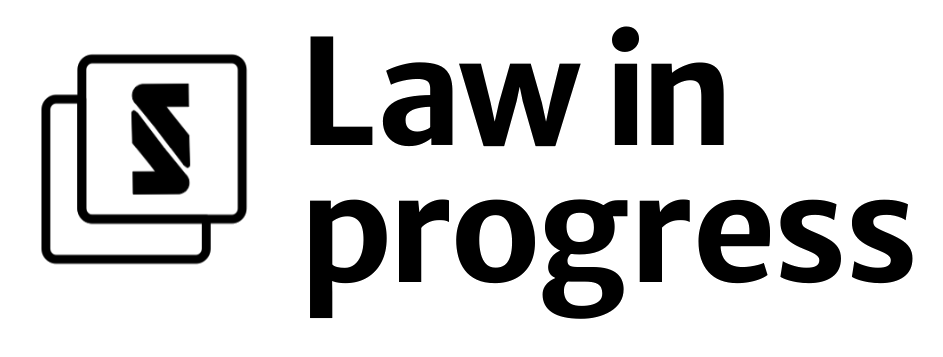

<br />
<div align="center">
  <a href="https://gitlab.com/nototast/lawinprogress/">
    
  </a>

  <p align="center">
    <br />
    Das Online-Tool "Law in Progress" macht Gesetzentwürfe und deren Konsequenzen für bestehende Gesetze durch automatische Erstellung einer Synopse sichtbar und nachvollziehbar.
    Aktuell werden nur Entwürfe von Bundesgesetzen unterstützt. Später sollen auch Entwürfe von Landesgesetzen genutzt werden können.
    <br />
    <br />
    <a href="http://app.lawinprogress.de">View Demo</a>
    ·
    <a href="https://gitlab.com/nototast/lawinprogress/-/issues">Report Bug</a>
    ·
    <a href="https://lawinprogress.de">Website</a>
    ·
    <a href="mailto: hello@lawinprogress.de">Request Feature</a>
    <br />
    <br />
    
  </p>
</div>

## Installation

1. Clone the main branch of this repository
2. Run `make poetry` and `make install` to setup poetry and the relevant requriements
3. Verify the installation by running the testsuite with `make test`.

## Usage
### How to run the web app

Run `make app` to start the webapp at `localhost:8000`.
An online version of the webapp is available at http://app.lawinprogress.de.
### Example usage as a script

To generate an updated version of the affected source_laws given a change law pdf, run

```bash
poetry run python ./scripts/generate_updated_version.py -c data/2000275.pdf
```

This will generate a before and after version of the changed laws in `./output`.


## Overview

```
├── pyproject.toml       --> Config for the project
├── README.md            --> This file
├── LICENSE              --> MIT license 
├── Makefile             --> Make target for setup, testing and cleaning
├── logging.conf         --> Configuration for the loggers used in this project
├── data/                --> Folder with some raw files of laws in text and pdf
├── scripts/             --> Folder with scripts to process laws and update the app
├── doc/                 --> Documentation and notes
├── notebooks/           --> Experimental notebooks
├── lawinprogress/       --> Main package
│   ├── __init__.py
│   ├── app/             --> contains the FastAPI webapp.
│   ├── templates/       --> contains html templates that power the webapp
│   ├── apply_changes/   --> modules to apply the proposed changes to source laws
│   ├── processing/      --> modules to process change law pdfs and extract required text
│   ├── parsing/         --> modules to parse source and change laws
│   └── libdiff/         --> modules to generate a html diff of the changed law
└── tests/               --> Test for the package
    ├── ...
    └── __init__.py
```


## Code checks & tests

1. To run the code quality checks (with isort, black and pylint) by running `make check`.
2. To run the tests, run `make test`.

## Acknowledgements

* Funded from September 2021 until February 2022 by 
